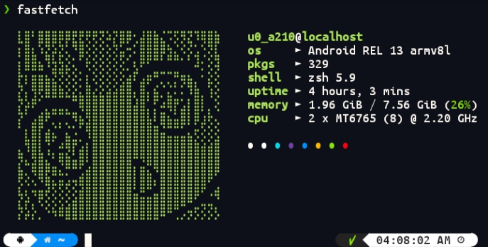

<p align='center'>


</p>

---


## $ Preview

<p align="center"></p>

---

## 🚀 Quick Start

```bash
# Clone this repo
git clone https://github.com/AndroidGeeksYT/dotfile_fastfetch ~/.config/fastfetch
```

---
